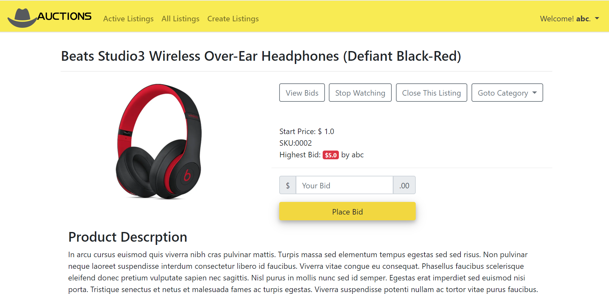

This Django project is an <strong>eBay-like e-commerce auction site</strong> that will allow users to post auction listings, place bids on listings, comment on those listings, and add listings to a “watchlist.” 

<a href="https://mini-auctions.herokuapp.com/" target="_blank"><strong>Live Demo</strong></a> 
User: abc 
Pwd: 123 

* Create Listing: Users will be able to visit a page to create a new listing. 
* Active Listings Page: The default route of the web application, will let users view all of the currently active auction listings.
* Listing Page: 
  - Shows all details about the listing, including the current price for the listing. 
  - User can add/remove the item to/from their “Watchlist.” 
  - User can bid on the item.
  - Listing owner can “close” the auction from this page, which makes the highest bidder the winner of the auction.
  - Signed in users can add comments to the listing page. 
* Watchlist: Users who are signed in can visit a Watchlist page.
* Categories: Users can visit a page showing all listings of a selected category. 

 - In auctions/models.py are Django Modeles and its fields.
 - In auctions/urls.py is the URL configuration for this app is defined.
 - In auctions/views.py functions will return results to the web browser.
 - In auctions/templates/auctions/ are templates inheriting from a base layout.html file.
 - CSS is in auctions/static/auctons/.
